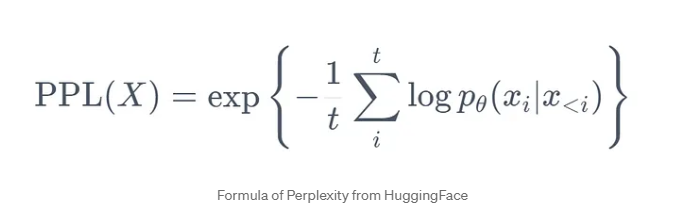
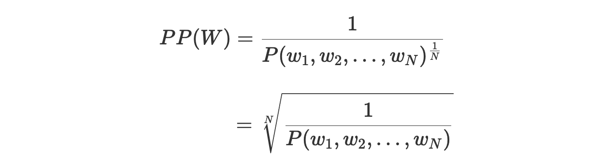

## The concept of **validation log perplexity** in LLM training - a note on fundamentals.

First to note that this metric applies specifically to autoregressive or causal language models (like GPT, where the goal is to predict the next word in a sequence.) and is not well defined for masked language models like BERT.

BERT like models are trained to predict the identity of masked tokens in a sentence, rather than predicting the next word in a sequence. As a result, the training objective and evaluation metrics are different. For MLMs, metrics such as accuracy or F1 score on the masked token prediction task are more relevant.

📌 First, perplexity is a measure of how well the probability distribution predicted by a model aligns with the actual distribution of the words in the language.

📌 A lower perplexity score indicates a better performance, because a lower score means the model assigns higher probabilities to the test words, suggesting that the model is better at predicting or "understanding" (i.e. is more certain ) the sequence of words in the test data.

### Mathematically, for a language model that assigns a probability P(w_1, w_2, ..., w_N) to a sequence of words w_1, w_2, ..., w_N, the perplexity PP of the sequence is given by:

## $$PP(w_1, w_2, ..., w_N) = P(w_1, w_2, ..., w_N)^{-\`frac`{1}{N}}$$

📌 Log perplexity is the logarithmic version of perplexity, which provides more stable and interpretable numbers, especially given that we often deal with very small probabilities in language models.

It is computed as:

## $$\text{Log Perplexity} = -\frac{1}{N} \sum_{i=1}^{N} \log P(w_i | w_1, w_2, ..., w_{i-1})$$

Where:

- N is the total number of words.

- P(w_i | w_1, w_2, ..., w_{i-1}) is the probability of word w_i given the preceding words in the sequence.

-------------

📌 Validation log perplexity, provides an estimate of how well the trained model would perform on unseen data.

📌 Lower is Better: If the validation log perplexity starts increasing while training perplexity continues to decrease, it's an indication of overfitting.

📌 So, when training an LLM the objective is to minimize the log perplexity, i.e. minimizing the negative log likelihood loss.

-----------

📌 Practical Considerations:

- **Numerical Stability**: Probabilities can be very small, causing numerical underflows. To avoid this, calculations are usually performed in the log space.

- **Tokenization**: The perplexity value can vary depending on the tokenization scheme used. For instance, using byte-pair encoding (BPE) versus word-level tokenization can lead to different perplexity values for the same text.

- Hence, it's important to ensure that perplexities are compared under the same conditions, especially in terms of tokenization and dataset preprocessing.

